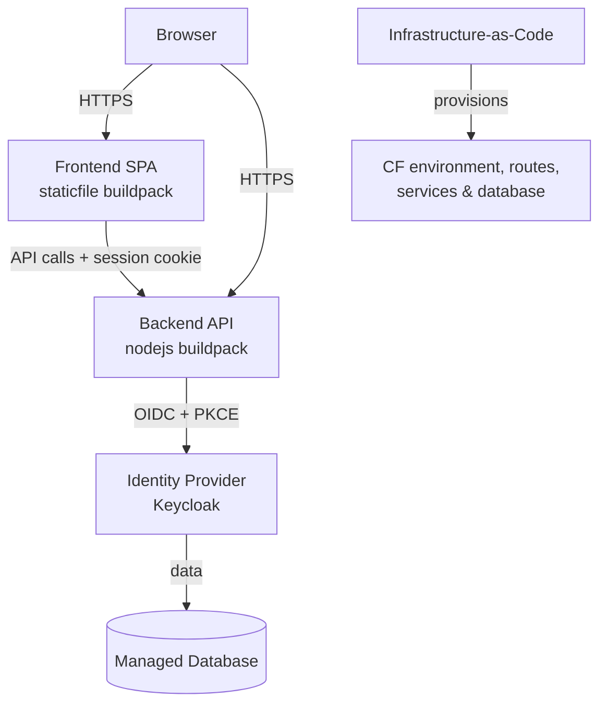

# Deploying a Standard Application on SAP BTP

A concise, client-facing approach for deploying a typical browser + API application.

---

## Overview

SAP BTP's **Cloud Foundry** runtime lets you push application code and managed services without managing servers or infrastructure.

| Layer | Component | Buildpack |
|---|---|---|
| Frontend | Static SPA (pre-built `dist/`) | `staticfile_buildpack` |
| Backend | Node.js API | `nodejs_buildpack` |
| Identity | OIDC provider (Keycloak) | Docker app |
| Database | Managed `postgresql-db` service | BTP managed service |



---

## Account Structure

| Level | Role |
|---|---|
| Global account | Billing / identity container |
| Subaccount | Project boundary |
| Environment (Cloud Foundry) | The runtime that hosts apps |
| Org / Space | Dev, test, prod grouping |

Reference target: trial account (AWS `us10-001`), shared domain `cfapps.us10-001.hana.ondemand.com`.

---

## Deployment Units

Each component is a Cloud Foundry app defined by its own `manifest.yml`.

**Frontend (static SPA)**
```yaml
applications:
  - name: sap-poc-app
    memory: 64M
    instances: 1
    path: ./dist
    buildpack: staticfile_buildpack
    routes:
      - route: sap-poc-app.cfapps.us10-001.hana.ondemand.com
```

**Backend (API)**
```yaml
applications:
  - name: sap-poc-api
    memory: 256M
    command: node server.js
    buildpacks:
      - nodejs_buildpack
    routes:
      - route: sap-poc-api.cfapps.us10-001.hana.ondemand.com
    env:
      KEYCLOAK_CLIENT_SECRET: "((KEYCLOAK_CLIENT_SECRET))"
      SESSION_SECRET: "((SESSION_SECRET))"
```

Secrets use `((VAR))` substitution and are injected at push time — never stored in git.

---

## Approach

1. **Provision infrastructure** (Terraform/OpenTofu)
   ```bash
   tofu init && tofu apply
   ```
   Creates the CF environment, space, routes, database, and identity app.

2. **Configure identity**
   ```bash
   tofu apply -var keycloak_url=... -var admin_user=... -var admin_password=...
   ```
   Creates the realm, OIDC client, and roles.

3. **Deploy backend**
   ```powershell
   cf push --var KEYCLOAK_CLIENT_SECRET=$env:KEYCLOAK_CLIENT_SECRET `
           --var SESSION_SECRET=$env:SESSION_SECRET
   ```

4. **Deploy frontend**
   ```bash
   npm run build && cf push
   ```

---

## Runtime Flow

1. Browser opens the SPA (public HTTPS route).
2. Login redirects to the backend, then to the identity provider (OAuth 2.0 + OIDC + PKCE).
3. Provider redirects back; backend stores a session and issues an `HttpOnly` cookie.
4. The SPA calls protected APIs with that cookie.

---

## Security

- Secrets injected at deploy time; none committed to source control.
- Frontend holds no secrets; backend owns the OIDC client secret.
- Authorization-code flow with PKCE; `HttpOnly` session cookie.

---

## Decision Points

| Topic | Question |
|---|---|
| Production vs. trial | Enterprise plan + custom domain required for production |
| Scaling / sessions | In-memory sessions need a shared store (e.g. Redis) to scale out |
| Secret management | CLI injection vs. a dedicated vault (Credential Store) |
| Configuration | Hardcoded URLs vs. BTP service bindings & runtime discovery |
| CI/CD | Manual steps vs. automated pipeline |

---

## Suggested Next Steps

1. Confirm **target environment** (production vs. trial, region, custom domain).
2. Resolve the **decision points** above into production recommendations.
3. Automate the sequence in a **CI/CD pipeline**.
