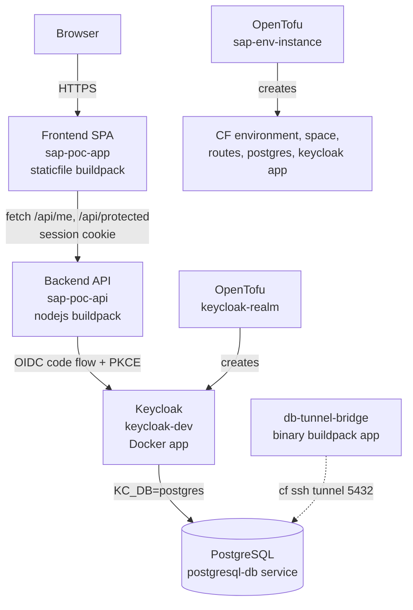

# SAP BTP Deployment Documentation — Keycloak OIDC Demo (sap-btp-poc)

This document describes **how a project can be deployed** on SAP BTP. 

---

## 1. Project Overview

A Keycloak OIDC authentication demo consisting of:

| Component | Technology | SAP BTP deployment target |
|---|---|---|
| Frontend | React 18 + Vite 5 (static SPA) | Cloud Foundry, staticfile buildpack |
| Backend | Express 4 + `openid-client` (Node.js) | Cloud Foundry, nodejs buildpack |
| Identity Provider | Keycloak (Docker image) | Cloud Foundry, Docker app |
| Database | PostgreSQL (SAP `postgresql-db` service) | Cloud Foundry managed service |
| Infrastructure | OpenTofu (Terraform-compatible) with SAP BTP, Cloud Foundry, and Keycloak providers | Runs from local machine / CI |

- The frontend holds **no secrets** and only an `HttpOnly` session cookie.
- The backend owns the OIDC client secret and performs the full authorization code flow with PKCE.
- All sessions and tokens are stored **in memory** in the backend process.

---

## 2. Target BTP Environment

The deployment targets a **BTP trial account** on the **AWS US10 (us10-001)** region.

| Property | Value (from `infra/sap-env-instance/main.tf`) |
|---|---|
| Global account | `a00c450ctrial` |
| Subaccount ID | `13e8a7a4-edd1-400d-9fee-f4ba78e0be10` |
| Environment | Cloud Foundry (trial plan), created by Terraform |
| CF shared domain | `cfapps.us10-001.hana.ondemand.com` |
| CF org / space | Org derived from the environment instance; space name = Terraform workspace name |

Deployed routes (all on the shared domain):

| Host | Application |
|---|---|
| `sap-poc-app.cfapps.us10-001.hana.ondemand.com` | Frontend SPA |
| `sap-poc-api.cfapps.us10-001.hana.ondemand.com` | Express backend |
| `keycloak-dev.cfapps.us10-001.hana.ondemand.com` | Keycloak |

---

## 3. Architecture



---

## 4. Repository Layout

```
sap-btp-poc/
├── backend/                    # Express OIDC backend
│   ├── server.js               # Entire backend (OIDC flow + session store)
│   ├── manifest.yml            # CF deployment descriptor
│   ├── package.json            # Scripts use bun; deps: express, openid-client, cors, dotenv
│   ├── bun.lock
│   └── .cfignore               # Excludes node_modules, .env, bun.lock from cf push
├── frontend/                   # React SPA
│   ├── src/                    # App.jsx, AuthContext.jsx, main.jsx, styles
│   ├── index.html
│   ├── manifest.yml            # CF deployment descriptor
│   ├── Staticfile              # pushstate: enabled
│   ├── vite.config.js          # Dev proxy points to the deployed API
│   ├── dist/                   # Vite build output (what actually gets pushed)
│   ├── package.json
│   ├── bun.lock
│   └── .cfignore
└── infra/
    ├── keycloak-realm/         # OpenTofu: realm/client/roles in Keycloak
    │   ├── main.tf
    │   ├── variables.tf
    │   ├── terraform.tfstate   # State present → this workspace has been applied
    │   └── .terraform.lock.hcl
    └── sap-env-instance/       # OpenTofu: BTP + CF environment provisioning
        ├── main.tf             # BTP subaccount CF env instance, CF space, roles
        ├── database.tf         # PostgreSQL service, credential binding, tunnel bridge app
        ├── keycloak.tf         # Routes, Keycloak Docker app, DB credential binding
        ├── run.sh              # Sleep-loop payload for the tunnel bridge app
        ├── bridge.zip          # Generated by the archive_file data source
        ├── terraform.tfstate.d # Empty (no workspace state files present)
        └── .terraform.lock.hcl
```

---

## 5. Infrastructure Provisioning (infra/sap-env-instance)

Provisioned with **OpenTofu** (`tofu` — lock files are maintained by `tofu init`), using providers from `registry.opentofu.org`:

| Provider | Version (from `.terraform.lock.hcl`) |
|---|---|
| `sap/btp` | 1.26.0 |
| `cloudfoundry/cloudfoundry` | 1.17.0 |
| `hashicorp/archive` | 2.8.0 |

### 5.1 `main.tf` — BTP Cloud Foundry environment

- `btp` provider is configured with `globalaccount = "a00c450ctrial"`.
- The `cloudfoundry` provider's `api_url` is read at runtime from the `API Endpoint` label of the environment instance resource.
- `btp_subaccount_environment_instance.cloudfoundry`:
  - Subaccount: `13e8a7a4-edd1-400d-9fee-f4ba78e0be10`
  - Name: `api_service_${terraform.workspace}`
  - Type/service: `cloudfoundry`, plan `trial`
- `cloudfoundry_space.app_space`: name = `terraform.workspace`, org = `Org ID` label of the env instance.
- `cloudfoundry_space_role.manager_role`: grants `space_developer` role to user `vinay.dg@quation.in`.

### 5.2 `database.tf` — PostgreSQL and tunnel bridge

- `cloudfoundry_service_instance.postgres_instance`:
  - Name `database`, offering `postgresql-db`, plan `trial`, managed
  - `engine_version = "17"`
  - `lifecycle { prevent_destroy = true }`
- `cloudfoundry_service_credential_binding.db_key`: credential key `ext_key` for the instance.
- `data.archive_file.bridge_zip`: zips `run.sh` into `bridge.zip`.
- `cloudfoundry_app.tunnel_bridge`:
  - Name `db-tunnel-bridge`, binary buildpack, 1 instance, 64M memory / 64M disk
  - `enable_ssh = true`, command `bash run.sh`, health check type `process`
  - `run.sh` is an infinite loop: `while true; do sleep 3600; done`
  - Purpose (from the code comment): reach the database from local machines via
    `cf ssh -L 5432:<postgres host>:<port> db-tunnel-bridge`

### 5.3 `keycloak.tf` — Keycloak app and routes

- Shared domain data source: `cfapps.us10-001.hana.ondemand.com`.
- CF routes created: `keycloak-dev`, `sap-poc-app`, `sap-poc-api` (hosts on the shared domain).
- `cloudfoundry_app.keycloak`:
  - Name `keycloak-slim`, Docker image `quay.io/keycloak/keycloak:latest`
  - 1 instance, 1024M memory / 1024M disk, health check type `process`
  - Command:
    ```
    /opt/keycloak/bin/kc.sh start --http-port=$PORT --http-enabled=true --proxy-headers=xforwarded --hostname-strict=false
    ```
  - Environment:
    | Variable | Value |
    |---|---|
    | `KC_DB` | `postgres` |
    | `KC_DB_SCHEMA` | `keycloak` |
    | `KC_DB_USERNAME` / `KC_DB_PASSWORD` / `KC_DB_URL_HOST` / `KC_DB_URL_PORT` / `KC_DB_URL_DATABASE` | From the `keycloak-db-credentials` binding credentials |
    | `KEYCLOAK_ADMIN` | `admin` |
    | `KEYCLOAK_ADMIN_PASSWORD` | Hardcoded in the `.tf` file |
    | `KC_LOG_LEVEL` | `INFO` |
  - A `service_bindings` block referencing the postgres instance is present but **commented out**; instead the DB credentials are injected via environment variables.
- `cloudfoundry_service_credential_binding.postgres_key`: credential key `keycloak-db-credentials` (type `key`, so it does not require an app ID and avoids a dependency cycle).

---

## 6. Keycloak Realm Provisioning (infra/keycloak-realm)

Provisioned with **OpenTofu** using the `keycloak/keycloak` provider **5.9.0**.

### 6.1 Provider and variables

- Provider connects to the Keycloak admin API with `client_id = "admin-cli"`, using username/password/URL supplied via variables (all variables are required, no defaults — values are supplied at apply time via `-var` or a `*.tfvars` file; `*.tfvars` is gitignored).

### 6.2 Resources

| Resource | Configured values |
|---|---|
| `keycloak_realm.my_app_realm` | Realm `sap-app`, enabled, `ssl_required = "external"`, login theme `keycloak`, `registration_allowed = true` |
| `keycloak_openid_client.web_app_client` | Client ID `sap-app-client`, name `SAP POC Client`, `access_type = CONFIDENTIAL`, standard flow enabled, frontchannel logout enabled, direct access grants enabled, redirect URIs and web origins from variables |
| `keycloak_role.app_roles` | Realm roles `app_admin`, `app_moderator`, `app_user` (via `for_each` over a variable list) |

The workspace contains `terraform.tfstate`, i.e., this configuration has been applied against the running Keycloak.

---

## 7. Backend Deployment (backend/)

### 7.1 `manifest.yml`

```yaml
applications:
  - name: sap-pod-api
    memory: 256M
    disk_quota: 512M
    command: node server.js
    buildpacks:
      - nodejs_buildpack
    routes:
      - route: sap-poc-api.cfapps.us10-001.hana.ondemand.com
    env:
      KEYCLOAK_URL: "https://keycloak-dev.cfapps.us10-001.hana.ondemand.com"
      KEYCLOAK_REALM: "sap-app"
      KEYCLOAK_CLIENT_ID: "sap-app-client"
      KEYCLOAK_CLIENT_SECRET: "((KEYCLOAK_CLIENT_SECRET))"
      FRONTEND_URL: "https://sap-poc-app.cfapps.us10-001.hana.ondemand.com"
      SESSION_SECRET: "((SESSION_SECRET))"
```

- App name is `sap-pod-api`; the route is `sap-poc-api.cfapps.us10-001.hana.ondemand.com`.
- `KEYCLOAK_CLIENT_SECRET` and `SESSION_SECRET` use Cloud Foundry's `((VAR))` variable-substitution syntax; they are passed on the command line at push time.
- The exact push command documented in the manifest comment:
  ```powershell
  cf push --var KEYCLOAK_CLIENT_SECRET=$env:KEYCLOAK_CLIENT_SECRET --var SESSION_SECRET=$env:SESSION_SECRET
  ```
  (PowerShell syntax — secrets come from the local shell environment, not from a `.env` file.)

### 7.2 `server.js` — runtime behavior

- On startup, performs OIDC discovery at `${KEYCLOAK_URL}/realms/${KEYCLOAK_REALM}` and creates an `openid-client` client:
  - `response_types: ["code"]`
  - `redirect_uris` hardcoded to `https://sap-poc-api.cfapps.us10-001.hana.ondemand.com/auth/callback`
  - `post_logout_redirect_uris` = `${FRONTEND_URL}/`
- **Session store:** in-memory `Map` (`sessions`) — sessions are lost on restart or scale-out.
- **Pending auth state:** in-memory `Map` keyed by the OIDC `state` param, entries cleaned up after 5 minutes.
- Session cookie: `sid=<hex>`; `HttpOnly; SameSite=Lax; Path=/; Max-Age=86400` (no `Secure` flag).
- Access token refresh happens server-side when within 60 s of expiry; on refresh failure the session is deleted and a 401 is returned.
- Routes:

| Route | Behavior |
|---|---|
| `GET /auth/login` | Generates PKCE (`S256`) state/verifier/challenge, stores verifier, redirects browser to Keycloak with scope `openid profile email` |
| `GET /auth/callback` | Validates `state`, exchanges code + client secret for tokens, stores tokens + user claims in the in-memory session, sets the `sid` cookie, redirects to `FRONTEND_URL/` |
| `GET /auth/logout` | Deletes local session, clears cookie, redirects to Keycloak end-session endpoint with `id_token_hint` |
| `GET /api/me` | Returns current user from session (401 if unauthenticated); refreshes tokens if expiring |
| `GET /api/protected` | Example protected endpoint returning user + timestamp (401 if unauthenticated) |

- CORS: `origin = FRONTEND_URL`, `credentials: true`.
- `PORT` defaults to `8080` in code; Cloud Foundry injects its own `PORT` at runtime.

### 7.3 `package.json` / `.cfignore`

- Dependencies: `cors ^2.8.5`, `dotenv ^16.4.5`, `express ^4.19.2`, `openid-client ^5.7.0`.
- Local scripts use **bun** (`bun server.js`, `bun --watch server.js`); the CF app runs `node server.js` via the nodejs buildpack.
- `.cfignore` excludes `node_modules`, `.env`, and `bun.lock` from the CF push.

---

## 8. Frontend Deployment (frontend/)

### 8.1 `manifest.yml`

```yaml
applications:
  - name: sap-poc-app
    memory: 64M
    disk_quota: 128M
    instances: 1
    path: ./dist
    buildpack: staticfile_buildpack
    routes:
      - route: sap-poc-app.cfapps.us10-001.hana.ondemand.com
```

- Only the pre-built `dist/` folder is pushed — the Vite build (`vite build`) runs **before** `cf push`.
- `Staticfile` contains `pushstate: enabled` (SPA client-side routing).

### 8.2 Application code

- React 18 + Vite 5. No routing library; a single `App` with guest view vs. dashboard.
- `frontend/src/AuthContext.jsx`:
  - `BACKEND` is hardcoded to `https://sap-poc-api.cfapps.us10-001.hana.ondemand.com`.
  - On load, calls `${BACKEND}/api/me` with `credentials: "include"`.
  - Login/logout are plain browser redirects to `${BACKEND}/auth/login` / `${BACKEND}/auth/logout`.
- `frontend/src/App.jsx`:
  - `apiUrl` hardcoded to the same API route; the "Call /api/protected" button fetches `${apiUrl}/api/protected` with `credentials: "include"`.
- No environment-variable indirection — the API URL is a hardcoded constant in two files.

### 8.3 `vite.config.js` (development only)

- Dev server on port `5173`.
- Proxies `/api` and `/auth` to `sap-poc-api.cfapps.us10-001.hana.ondemand.com` with `changeOrigin: true` — i.e., local development talks to the **deployed** backend.

---

## 9. Deployment Sequence (as currently done)

The components are deployed in this order (implied by the configuration dependencies):

1. **Provision BTP/CF infrastructure** — from `infra/sap-env-instance`:
   ```bash
   tofu init
   tofu apply
   ```
   Creates the CF environment instance in the trial subaccount, the CF space, the PostgreSQL service, the Keycloak Docker app, the three routes, and the `db-tunnel-bridge` app.

2. **Configure Keycloak** — from `infra/keycloak-realm`:
   ```bash
   tofu init
   tofu apply -var keycloak_url=... -var keycloak_admin_username=... -var keycloak_admin_password=... -var realm_name=sap-app ... 
   ```
   (all variables required; values supplied at apply time)
   Creates realm `sap-app`, confidential client `sap-app-client`, and roles `app_admin` / `app_moderator` / `app_user`.

3. **Deploy backend** — from `backend/`:
   ```powershell
   cf push --var KEYCLOAK_CLIENT_SECRET=$env:KEYCLOAK_CLIENT_SECRET --var SESSION_SECRET=$env:SESSION_SECRET
   ```

4. **Deploy frontend** — from `frontend/`:
   ```bash
   npm run build     # or bun run build → produces dist/
   cf push
   ```

---

## 10. Runtime Authentication Flow on BTP

1. Browser opens `https://sap-poc-app.cfapps.us10-001.hana.ondemand.com` (static SPA).
2. "Sign in" redirects to `https://sap-poc-api.cfapps.us10-001.hana.ondemand.com/auth/login`.
3. Backend redirects to Keycloak `https://keycloak-dev.cfapps.us10-001.hana.ondemand.com/realms/sap-app/...` with PKCE parameters.
4. Keycloak redirects back to `https://sap-poc-api.cfapps.us10-001.hana.ondemand.com/auth/callback?code=...`.
5. Backend exchanges the code (client secret + PKCE verifier) and stores tokens in its in-memory session store.
6. Browser receives an `HttpOnly` `sid` cookie and is redirected to `https://sap-poc-app.cfapps.us10-001.hana.ondemand.com/`.
7. SPA calls `/api/me` (and optionally `/api/protected`) with the cookie; the backend validates/refreshes the session server-side.

---

## 11. Secrets and Configuration Handling (current state)

- Backend secrets (`KEYCLOAK_CLIENT_SECRET`, `SESSION_SECRET`) are supplied as `cf push --var` values from the local shell; they are not stored in the repository.
- `.env` files exist locally for development (referenced by the README) and are excluded from CF pushes via `.cfignore` and from git via `.gitignore` (`.env`, `**/.env`).
- `*.tfvars`, `*.tfstate`, `*.tfstate.*`, and `*.tfplan` are gitignored; only `*.example.tfvars` is allowed.
- The Keycloak admin password is hardcoded in `infra/sap-env-instance/keycloak.tf`.
- Terraform state: `infra/keycloak-realm/terraform.tfstate` exists locally; `infra/sap-env-instance/terraform.tfstate.d` is empty (no per-workspace state files present).

## 12. Current Operational Characteristics

- Backend sessions are **in-memory only**: a restart or a second instance loses all sessions.
- The frontend and backend hardcode each other's URLs and the Keycloak URL in source/manifest (no BTP service bindings or runtime discovery).
- The Keycloak app binds to PostgreSQL via environment variables read from the service credential binding, not via a CF service binding.
- Local database access is performed via an SSH tunnel through the `db-tunnel-bridge` app.
- Both apps deploy to the shared `cfapps.us10-001.hana.ondemand.com` domain (trial landscape).
